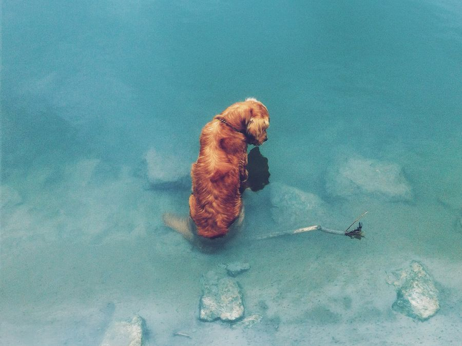

#Pixel Nudge
A fun node.js tool for creating distorted gifs.
Main project is in src directory. gif.rb has an example how to run.

##Installation
`brew install jpeg`

`brew install imagemagick`

`npm install`

##Usage
`ruby gif.rb dog.jpg`

##Examples

####Input

####Output

####Other examples

